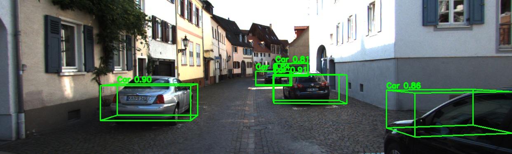

# YOLOv12-3D with DINO Integration

[](https://www.kmutt.ac.th/)
[](https://www.python.org/)
[](https://pytorch.org/)
[](LICENSE)

Monocular YOLOv12 extended with a 3D detection head and enhanced with DINO (Self-supervised Vision Transformer) integration for improved feature extraction on the KITTI benchmark. The repository provides comprehensive CLI tools for dataset preparation, training, validation, inference, and export.



## Features

- **DINO ViT-B Integration**: Self-supervised Vision Transformer for enhanced feature extraction
  - **Single-Scale (P0)**: Lightweight integration for resource-constrained environments
  - **Dual-Scale (P0+P3)**: Maximum performance with multi-level feature enhancement
- 3D-aware detections (depth, dimensions, yaw) on top of YOLOv12 accuracy and speed
- Unified CLI tools (`yolo3d.py` and `yolodio3d.py`) for all operations
- **Video 3D detection** with real-time 3D bounding box visualization
- Automated KITTI setup utilities with verification and split management
- Multiple model scales (m/l with DINO, n/s/m/l/x without DINO) to balance FPS and accuracy
- Flexible DINO integration modes (enable/disable as needed)

## Quick Start

```bash
git clone https://github.com/Sompote/DINO-YOLO3D.git
cd DINO-YOLO3D
pip install -r requirements.txt
pip install ultralytics torch torchvision transformers
```

**Note**: The `transformers` package is required for DINO ViT-B integration. If you're only using the base YOLOv12-3D model (without DINO), you can skip this dependency.

### Prepare KITTI

```bash
# Recommended: end-to-end download and extraction (Linux)
./download_kitti.sh

# or for cross-platform setups
python download_kitti.py --extract
python scripts/kitti_setup.py all --create-yaml
```

## DINO Integration

YOLOv12-3D now supports optional DINO (Self-supervised Vision Transformer) integration for enhanced feature extraction. DINO provides rich semantic features that improve 3D object detection accuracy.

### DINO Integration Modes

#### 1. **Dual-Scale Integration (P0+P3)** - Maximum Performance
- DINO features integrated at both P0 (early stage) and P3 (mid-level, 1/8 resolution)
- Best accuracy for complex scenes
- Higher memory usage (~4-6GB for medium, ~6-8GB for large)
- Recommended for production and maximum accuracy

#### 2. **Single-Scale Integration (P0 only)** - Lightweight
- DINO features integrated at P0 (early stage) only
- Faster training and inference
- Lower memory requirements (~3-4GB for medium, ~5-6GB for large)
- Best for limited computational resources

#### 3. **No DINO** - Base YOLOv12-3D
- Standard YOLOv12-3D without DINO enhancement
- Fastest training and inference
- Lowest memory requirements
- Good for quick prototyping

### Model Variants

| Model | DINO Mode | Parameters | GPU Memory | Speed | Best For |
|-------|-----------|------------|------------|-------|----------|
| YOLOv12m-3D-DINO (P0) | Single | ~100M | ~3-4GB | Fast | Balanced performance |
| YOLOv12m-3D-DINO (P0+P3) | Dual | ~120M | ~4-6GB | Moderate | Better accuracy |
| YOLOv12l-3D-DINO (P0) | Single | ~160M | ~5-6GB | Moderate | High performance |
| YOLOv12l-3D-DINO (P0+P3) | Dual | ~180M | ~6-8GB | Slower | Maximum accuracy |
| YOLOv12-3D (base) | None | Varies | ~2-4GB | Fastest | Quick prototyping |

### Train, Validate, Infer

#### Using DINO-Enhanced Models (yolodio3d.py)

```bash
# Train YOLOv12m-3D with DINO dual-scale (P0+P3) - RECOMMENDED
python yolodio3d.py train \
    --data ultralytics/cfg/datasets/kitti-3d.yaml \
    --yolo-size m \
    --dino-integration dual \
    --epochs 100 \
    --batch-size 16

# Train YOLOv12l-3D with DINO single-scale (P0 only) - Lightweight
python yolodio3d.py train \
    --data ultralytics/cfg/datasets/kitti-3d.yaml \
    --yolo-size l \
    --dino-integration single \
    --epochs 100 \
    --batch-size 8

# Train without DINO (base YOLOv12-3D)
python yolodio3d.py train \
    --data ultralytics/cfg/datasets/kitti-3d.yaml \
    --yolo-size m \
    --no-dino \
    --epochs 100

# Validate DINO model
python yolodio3d.py val \
    --data ultralytics/cfg/datasets/kitti-3d.yaml \
    --yolo-size m \
    --dino-integration dual \
    --model runs/train/yolov12-3d-dino/weights/best.pt

# Predict with DINO model
python yolodio3d.py predict \
    --model runs/train/yolov12-3d-dino/weights/best.pt \
    --source path/to/images \
    --conf 0.25 \
    --save

# Export DINO model to ONNX
python yolodio3d.py export \
    --model runs/train/yolov12-3d-dino/weights/best.pt \
    --format onnx \
    --simplify
```

#### Using Base Models (yolo3d.py)

```bash
# Train base YOLOv12-3D (no DINO)
python yolo3d.py train --data kitti-3d.yaml --epochs 100 -y

# Validate a checkpoint
python yolo3d.py val --model runs/detect/train/weights/best.pt --data kitti-3d.yaml

# Run inference on an image folder
python yolo3d.py predict --model runs/detect/train/weights/best.pt --source path/to/images --conf 0.25

# Export to ONNX
python yolo3d.py export --model best.pt --format onnx
```

#### Video 3D Detection (Works with both DINO and base models)

```bash
# Process video with 3D bounding boxes (only 3D boxes, no 2D)
python video_3d_clean.py --input path/to/video.mov --output result.mp4

# Fast processing options
python video_3d_clean.py --max-frames 100           # First 100 frames only
python video_3d_clean.py --skip 5                   # Every 5th frame for speed
python video_3d_clean.py --max-frames 100 --skip 3  # Combined for fast preview
```

## Performance

### Inference Speed
- **CPU (4 cores):** 2.6 FPS
- **CPU (YOLOv8-M baseline):** 4 FPS
- **RTX 4090:** 40-50 FPS
- **RTX 5090:** 100 FPS
- **Input Resolution:** 1920x650

### Speed Benchmark Details
View full benchmark results: [`INFERENCE_SPEED.md`](INFERENCE_SPEED.md)

**Benchmark Configuration:**
- Test runs: 50 inference runs
- Warmup: 10 runs
- Model: YOLOv12-3D (last-4.pt)
- Image size: 1920x650 pixels

**Optimization Tips:**
- Use `--skip N` to process every Nth frame for faster processing
- Reduce input resolution for 2-3x speedup
- Increase confidence threshold (`--conf 0.5`) for faster post-processing

## Documentation

- `YOLODIO3D_README.md` – comprehensive DINO integration guide
- `CLI_GUIDE.md` – full command reference for base models
- `YOLO3D_QUICKREF.md` – parameter cheat sheet
- `KITTI_DOWNLOAD_GUIDE.md` – manual download walkthrough
- `scripts/README.md` – dataset automation details
- `IMPLEMENTATION_SUMMARY.md` – architecture and loss overview
- `INFERENCE_SPEED.md` – detailed inference speed benchmarks

## Repository Layout

```
DINO-YOLO3D/
├── yolo3d.py                           # CLI for base YOLOv12-3D models
├── yolodio3d.py                        # CLI for DINO-enhanced models
├── video_3d_clean.py                   # Video 3D detection script
├── scripts/kitti_setup.py              # Dataset automation
├── ultralytics/                        # Model, loss, and trainer extensions
│   ├── nn/modules/block.py             # Contains DINO3Backbone class
│   └── cfg/models/v12/
│       ├── yolov12-3d.yaml             # Base YOLOv12-3D config
│       ├── yolov12m-3d-dino-p0.yaml    # Medium DINO single-scale
│       ├── yolov12m-3d-dino-p0p3.yaml  # Medium DINO dual-scale
│       ├── yolov12l-3d-dino-p0.yaml    # Large DINO single-scale
│       └── yolov12l-3d-dino-p0p3.yaml  # Large DINO dual-scale
├── assets/                             # Project figures
├── result.mp4                          # Example video output (50MB)
├── result_preview.gif                  # GitHub-playable preview (4MB)
├── benchmark_speed.py                  # Speed benchmark script
├── YOLODIO3D_README.md                 # DINO integration guide
├── INFERENCE_SPEED.md                  # Performance benchmarks
└── docs & guides                       # *.md reference material
```

## DINO Architecture Details

### Integration Strategy

The DINO3Backbone class integrates DINOv3 Vision Transformer features into YOLOv12-3D at specific pyramid levels:

**P0 Level (Early Features):**
- Integrated immediately after the first convolution layer
- Provides high-level semantic understanding from the beginning
- Uses dinov3_vitb16 ViT-B backbone by default
- Features are fused with CNN features using projection layers

**P3 Level (Mid-Level Features, Dual Mode only):**
- Integrated at 1/8 resolution for enhanced object detection
- Enriches mid-level features with semantic information
- Improves detection of objects at medium scales

### DINO Backbone Options

The system supports multiple DINO variants:

- **ViT Models**: dinov3_vits16, dinov3_vitb16, dinov3_vitl16, dinov3_vith16_plus
- **ConvNeXt Models**: dinov3_convnext_tiny, dinov3_convnext_small, dinov3_convnext_base
- **Default**: dinov3_vitb16 (Best balance of performance and efficiency)

### Loading Strategy

DINO models are loaded with automatic fallback:
1. PyTorch Hub (facebookresearch/dinov3)
2. Hugging Face (facebook organization)
3. DINOv2 fallback (compatible models)
4. Random initialization (last resort)

### Training Recommendations

- **Freeze DINO Backbone**: Enabled by default for faster training
- **Batch Sizes**:
  - Dual-scale: 8-16 (medium), 4-8 (large)
  - Single-scale: 16-32 (medium), 8-16 (large)
- **Learning Rate**: Use default Ultralytics settings
- **Augmentation**: Standard KITTI augmentation works well

## CLI Quick Reference

### yolodio3d.py (DINO-Enhanced Models)

| Command | Description | Key Arguments |
|---------|-------------|---------------|
| `train` | Train DINO model | `--yolo-size {m,l}`, `--dino-integration {single,dual}`, `--no-dino` |
| `val` | Validate model | `--model`, `--dino-integration {single,dual}` |
| `predict` | Run inference | `--model`, `--source`, `--conf` |
| `export` | Export model | `--format {onnx,torchscript,...}`, `--simplify` |

**Common Options:**
- `--dino-integration dual`: Dual-scale (P0+P3) for maximum performance
- `--dino-integration single`: Single-scale (P0) for lightweight
- `--no-dino`: Disable DINO (use base YOLOv12-3D)
- `--freeze-dino`: Freeze DINO weights (enabled by default)

### yolo3d.py (Base Models)

Standard YOLOv12-3D CLI without DINO integration. Use for:
- Quick prototyping
- Baseline comparisons
- Legacy compatibility
- Lower resource requirements

## Example Results

### Image Detection


### Video Detection (GitHub plays GIF below)


**Full Video Output:** `result.mp4` (50MB, 24 seconds) - Full 3D object detection video with bounding boxes on street scene
**Preview GIF:** `result_preview.gif` (4MB, 5 seconds) - GitHub-playable preview
**Source Code:** `video_3d_clean.py` - Script for video processing with 3D bounding boxes

## Contributing & License

Contributions are welcome—please open an issue or submit a PR with improvements, fixes, or new features. The project is released under the AGPL-3.0 license (see `LICENSE`).

For collaboration or academic inquiries, contact the AI Research Group, Department of Civil Engineering, KMUTT.

